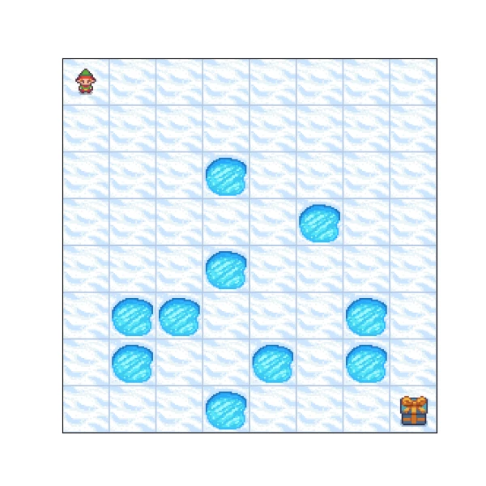
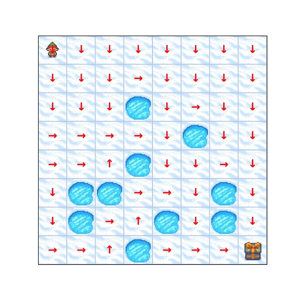

## Introduction

Reinforcement learning is about learning from consequences. Unlike supervised learning, nobody tells the agent the correct action for every situation. The agent tries actions, receives rewards, and slowly discovers which behavior leads to better long-term outcomes.

Imagine playing a computer game. You observe the screen, make a decision, and the game responds. Sometimes you get points immediately, sometimes nothing happens, and sometimes the real consequence appears much later. The same idea can be described in a more abstract mathematical language. In such a formal language, you are the agent and the game is the environment.

- You observe a state of the environment $s_t$ at a timestamp $t$.
- You execute an action $a_t$ by following your policy function $\pi$, which chooses actions based on the current state of the environment $s_t$.
- You get a reward $r_t$.
- The environment transitions to a new state $s_{t+1}$.

This loop is simple, but the hard part is credit assignment. An action can look useless now and still be important because it leads to a better state later. If you move toward a key in a game, the reward may appear only many steps later when the key opens a door.

So instead of asking which action gives the biggest reward immediately, reinforcement learning asks a broader question: which action puts the agent on a path with the best future? Here, the best future means the one with the largest accumulated reward, not necessarily the largest next reward. To make that question precise, we need one number that summarizes all future rewards from the current time step. This number is called the return $g_t$.

$$
g_t = r_{t} + r_{t+1} + r_{t+2} + \ldots = \sum_{k=0}^{\infty} r_{t+k}
$$

However, if the game continues forever, this definition of $g_t$ may produce an infinite sum, which imposes certain mathematical complications. In practice, we usually replace $g_t$ with discounted cumulative rewards where $0 \leq \gamma \leq 1$ represents a discount factor.

$$
g_t = r_{t} + \gamma r_{t+1} + \gamma^2 r_{t+2} + \ldots = \sum_{k=0}^{\infty} \gamma^k r_{t+k}
$$

Discounting has two purposes.

First, the mathematical reason. When $\gamma < 1$, rewards far in the future become smaller and the infinite sum can stay finite. To see this, assume a constant reward at each timestamp $r_t = r$. Then the discounted return becomes a finite geometric series.

$$
g_t = r + \gamma r + \gamma^2 r + \ldots = r \sum_{k=0}^{\infty} \gamma^k = \frac{r}{1-\gamma}
$$

Second, the modeling reason. The discount factor limits the effective horizon of an action. A reward $k$ steps in the future is worth $\gamma^k$ today, so a smaller $\gamma$ makes the agent more short-sighted, while a larger $\gamma$ makes it more patient.

At this point we have a way to score one realized future, but in reinforcement learning the future is often not fully predictable. The same state and action can lead to different next states or rewards. Instead of ignoring this randomness, we need a framework that can model it. This is why we use probabilistic theory and move from concrete values to random variables. A realized state $s_t$ becomes a random variable $S_t$, a realized action $a_t$ becomes $A_t$, a realized reward $r_t$ becomes $R_t$, and a realized return $g_t$ becomes $G_t$.

Randomness appears in two places.

- Environment randomness: if $S_t = s_t$ and $A_t = a_t$, we don't always have to get the same next state $S_{t+1}$ or the same reward $R_t$. In a game, the same move can miss, slip, or trigger a random event.
- Policy randomness: the policy itself can also be stochastic. Instead of always choosing one action, $\pi(a \mid s)$ can assign probabilities to actions. This is useful for exploration, for avoiding commitment to a bad action too early, and for describing strategies that intentionally mix actions.

With this probabilistic notation, the policy function $\pi$ will be represented as a probability distribution over actions.
The discounted return is also a random variable now:

$$
G_t = R_{t} + \gamma R_{t+1} + \gamma^2 R_{t+2} + \ldots = \sum_{k=0}^{\infty} \gamma^k R_{t+k}
$$

The learning goal is to find a policy $\pi$ that makes future return as large as possible. Since $G_t$ is random, this means maximizing its expectation: the expected discounted cumulative reward.

$$
\mathbb{E}[G_t \mid S_t = s_t, A_{t-1} = a_{t-1}, S_{t-1} = s_{t-1}, \ldots, S_0 = s_0, A_0 = a_0]
$$

This expression conditions on the entire history of the episode. In principle, the value of the current situation could depend on every state and action that happened before. That is difficult to work with, so in reinforcement learning we often assume that the process is a Markov Decision Process (MDP).

The Markov assumption says that the current state already contains all information needed for the next transition. Once we know the current state $s_t$ and action $a_t$, the next state does not depend on the older history.

$$
p(s_{t+1} \mid s_t, a_t, s_{t-1}, a_{t-1}, \ldots, s_0, a_0) = p(s_{t+1} \mid s_t, a_t)
$$

This lets us replace the full-history question with a state-based question: if I am in state $s$, what return should I expect from here? That is the object we will formalize as the value function in the next section.

$$
\mathbb{E}[G_t \mid S_t = s]
$$

## Bellman Equations

In the introduction, we defined the discounted return as a sum of future rewards. To derive Bellman equations, we now use the same return in a recursive form: the return from today is the immediate reward plus the discounted return from the next time step.

$$
G_t = R_t + \gamma G_{t+1}
$$

This recursive form is the starting point for the Bellman equations. Once we define the value function as the expected return, we will substitute this recursive expression for $G_t$ into that expectation.

### Value Function

The goal of reinforcement learning is to find an optimal policy $\pi^*(s)$ that maximizes the expected discounted cumulative reward for every state $s$. The star in $\pi^*$ means optimal.

Before we can find the best policy, we need a way to evaluate a policy. For a policy $\pi$, we define $v_\pi(s)$ as the expected return when the agent starts in state $s$ and follows $\pi$. This quantity is called the value function.

$$
v_\pi(s) = \mathbb{E}_\pi[G_t \mid S_t = s]
$$

You already use something like a value function intuitively. Imagine playing chess. There is no immediate reward after every move, but at some point you can look at the board and know that your position is probably lost. You might even resign before checkmate because you can predict the future from the current state. That prediction is the value of the state: how good this position is expected to be if you keep playing from here.

### Bellman Expectation Equation

The definition of $v_\pi(s)$ tells us what the value function means, but it is not yet very useful for computation. It asks for the expected return over the whole future. To make it practical, we substitute the recursive form of $G_t$ into this expectation, separating the immediate reward from the expected value of the continuation.

$$
\begin{aligned}
v_\pi(s) &= \mathbb{E}_\pi[G_t \mid S_t = s] && {\scriptsize\text{(definition of } v_\pi \text{)}} \\[0.5em]
&= \mathbb{E}_\pi[R_t + \gamma G_{t+1} \mid S_t = s] && {\scriptsize\text{(recursive definition of } G_t \text{)}} \\[0.5em]
&= \mathbb{E}_\pi[R_t \mid S_t = s] + \gamma \mathbb{E}_\pi[G_{t+1} \mid S_t = s] && {\scriptsize\text{(linearity of expectation)}} \\[0.5em]
&= \mathbb{E}_\pi[R_t \mid S_t = s] + \gamma \sum_{s^\prime} p(s^\prime \mid s)\mathbb{E}_\pi[G_{t+1} \mid S_t = s,S_{t+1} = s^\prime] && {\scriptsize\text{(law of total expectation)}} \\[0.5em]
&= \mathbb{E}_\pi[R_t \mid S_t = s] + \gamma \sum_{s^\prime} p(s^\prime \mid s)\mathbb{E}_\pi[G_{t+1} \mid S_{t+1} = s^\prime] && {\scriptsize\text{(Markov assumption)}} \\[0.5em]
&= \mathbb{E}_\pi[R_t \mid S_t = s] + \gamma \sum_{s^\prime} p(s^\prime \mid s) v_\pi(s^\prime) && {\scriptsize\text{(definition of } v_\pi \text{)}} \\[0.5em]
&= \mathbb{E}_\pi[R_t \mid S_t = s] + \gamma \sum_{r, a, s^\prime} p(r, a, s^\prime \mid s) v_\pi(s^\prime) && {\scriptsize\text{(marginalization)}} \\[0.5em]
&= \sum_{r, a, s^\prime} p(r, a, s^\prime \mid s) r + \gamma \sum_{r, a, s^\prime} p(r, a, s^\prime \mid s) v_\pi(s^\prime) && {\scriptsize\text{(definition of } \mathbb{E}_\pi \text{)}} \\[0.5em]
&= \sum_{r, a, s^\prime} p(r, a, s^\prime \mid s) (r + \gamma v_\pi(s^\prime)) && {\scriptsize\text{(probability chain rule)}}  \\[0.5em]
&= \sum_{a}p (a \mid s) \sum_{r, s^\prime} p(r, s^\prime \mid s, a) (r + \gamma v_\pi(s^\prime)) \\[0.5em]
&= \sum_{a}\pi (a \mid s) \sum_{r, s^\prime} p(r, s^\prime \mid s, a) (r + \gamma v_\pi(s^\prime)) \\[0.5em]
\end{aligned}
$$

So the final form is:

$$
v_\pi(s) = \sum_{a}\pi(a \mid s) \sum_{r, s^\prime} p(r, s^\prime \mid s, a) (r + \gamma v_\pi(s^\prime))
$$

This is the Bellman expectation equation. It says that the value of state $s$ under policy $\pi$ is the expected immediate reward plus the discounted value of the next state. The expectation averages over both sources of randomness: the action chosen by the policy and the next state and reward produced by the environment.

The subscript in $v_\pi(s)$ matters. If we change the policy, the action probabilities $\pi(a \mid s)$ change, and the value of the same state can change as well. This is why the Bellman expectation equation is used for policy evaluation: it tells us how good each state is for a fixed policy.

### Action-value Function

The value function answers a state question: if the agent is in state $s$ and follows policy $\pi$, what return should we expect? For policy improvement, we often need a more specific question: if the agent is in state $s$, takes action $a$ first, and then follows $\pi$, what return should we expect?

This is the action-value function $q_\pi(s, a)$:

$$
q_\pi(s, a) = \mathbb{E}_\pi[G_t \mid S_t = s, A_t = a] = \sum_{r, s^\prime} p(r, s^\prime \mid s, a)(r + \gamma v_\pi(s^\prime))
$$

Because $q_\pi(s, a)$ already conditions on the first action, we no longer average over actions inside its definition. If we want the value of the state again, we can average the action-values using the policy:

$$
v_\pi(s) =  \sum_{a}\pi(a \mid s) q_\pi(s, a)
$$

The action-value function is useful because it lets us compare actions in the same state. This comparison is exactly what we need when we move from evaluating a fixed policy to improving it.

### Bellman Optimality Equation

The Bellman expectation equation evaluates a fixed policy. But the final goal is not just to evaluate one policy. We want the best policy.

If we know the action-value of each possible action, then the best policy should choose an action with the highest action-value. This replaces the policy average with a maximum over actions. The result is the Bellman optimality equation:

$$
v^*(s) = \max_{a} \sum_{r, s^\prime} p(r, s^\prime \mid s, a) (r + \gamma v^*(s^\prime)) = \max_{a} q^*(s, a)
$$

Here $q^*(s, a)$ is the action-value when the agent takes action $a$ first and behaves optimally afterward.

Unlike $v_\pi(s)$, the optimal value function $v^*(s)$ does not describe one fixed policy. It describes the best achievable expected return from each state. Once we know $v^*(s)$, we can recover an optimal policy by choosing an action with the highest $q^*(s, a)$ in each state.

At this point, we have equations that characterize the value functions we want. The Bellman expectation equation characterizes $v_\pi(s)$ for a fixed policy, and the Bellman optimality equation characterizes $v^*(s)$ for the best policy. But an equation is not yet an algorithm. To find these value functions in practice, we need a procedure that starts with a rough guess, updates it repeatedly, and eventually converges to the right answer.

This is where contraction mapping enters the story.

## Contraction Mapping

Contraction mapping is not specific to reinforcement learning. It is a general idea from metric spaces, where we study points, distances between points, and functions that move points around. The definition and theorem below show one important result: if a function always moves points closer together, then repeatedly applying that function converges to a unique fixed point.

This sounds abstract, but it will become useful because the Bellman equations are recursive. Later, we will treat the right-hand side of a Bellman equation as a function that updates a value function. Contraction mapping gives us the language to explain why applying that update repeatedly can converge, which is exactly what we need for Value Iteration and Policy Iteration.

### Definition

A contraction mapping is a function $T: X \rightarrow X$ on a metric space $X$. It takes a point from $X$ and returns another point in the same space. It is called a contraction if applying $T$ always brings points closer together.

More formally, there must be a constant $0 \leq \kappa < 1$ such that for any two points $x$ and $y$:

$$d(T(x), T(y)) \leq \kappa \cdot d(x, y)$$

In other words, after applying $T$, the distance between two points is at most $\kappa$ times the original distance.

### Banach Fixed-Point Theorem

The Banach Fixed-Point Theorem gives us the guarantee that makes contraction mappings useful. If $T$ is a contraction mapping, then:

1. $T$ has a unique fixed point $x^*$ such that $T(x^*) = x^*$.
2. For any initial point $x_0$ in the space, the sequence $x_0, T(x_0), T(T(x_0)), \ldots$ converges to that fixed point $x^*$.

Algorithmically, this means: if an update rule is a contraction, then repeatedly applying it is guaranteed to converge to one solution.

### Applications in RL

Now we can connect this abstract theorem back to reinforcement learning.

The Bellman equations are recursive: the value of the current state is written using the values of possible next states. For example $v_\pi(s)$ depends on $v_\pi(s^\prime)$. This means the same unknown function appears on both sides of the equation.

That recursive form is exactly what lets us turn a Bellman equation into an update rule. Instead of already knowing the true value function, we start with some current guess $v$. Then we plug that guess into the right-hand side of the Bellman equation and get an updated guess. This update rule is the operator $T$ from the fixed-point theorem.

For a fixed policy $\pi$, the Bellman expectation operator is:

$$T^\pi v(s) = \sum_{a} \pi(a \mid s) \sum_{r, s^\prime} p(r, s^\prime \mid s, a) (r + \gamma v(s^\prime))$$

For the optimal value function, the Bellman optimality operator is:

$$T^* v(s) = \max_{a} \sum_{r, s^\prime} p(r, s^\prime \mid s, a) (r + \gamma v(s^\prime))$$

A key result, which we will use without proving here, is that both Bellman operators are contraction mappings when $0 \leq \gamma < 1$. So Banach's theorem tells us that repeated Bellman updates converge to a unique fixed point.

For the Bellman expectation operator $T^\pi$, the fixed point is $v_\pi$, the value function for policy $\pi$. For the Bellman optimality operator $T^*$, the fixed point is $v^*$, the optimal value function.

This is the bridge from equations to algorithms. The Bellman equations define the fixed points, and contraction mapping explains why repeated updates can find them. In the next section, we will turn these two update rules into Value Iteration and Policy Iteration.

## Algorithms

We now have the ingredients for two common algorithms. The Bellman optimality operator gives us a way to update values toward $v^*(s)$ directly. The Bellman expectation operator gives us a way to evaluate a fixed policy $\pi$. Both ideas can be used to find an optimal policy, but they organize the work differently.

### Value Iteration

Value Iteration uses the Bellman optimality operator directly. The algorithm is:

1. Start with some initial value function $v_0(s)$, which can be a rough guess.
2. Repeatedly apply the Bellman optimality update:

   $$
   v_{k+1}(s) = \max_{a} \sum_{r, s^\prime} p(r, s^\prime \mid s, a) (r + \gamma v_k(s^\prime))
   $$

   Because this update is a contraction when $0 \leq \gamma < 1$, repeated updates converge to the optimal value function $v^*(s)$.

3. Stop when the value function changes only slightly between two iterations, for example when:

   $$
   \max_s |v_{k+1}(s) - v_k(s)| \leq \epsilon
   $$

4. Once the values have converged, extract a policy greedily. First compute the optimal action-value:

   $$
   q^*(s, a) = \sum_{r, s^\prime} p(r, s^\prime \mid s, a)(r + \gamma v^*(s^\prime))
   $$

   Then choose an action with the highest action-value in each state:

   $$
   \pi^*(s) = \argmax_{a} q^*(s, a)
   $$

The important detail is that Value Iteration does not maintain or evaluate a separate policy during the updates. The intermediate function $v_k(s)$ is only a working value estimate. A greedy policy can be extracted from it at any time, but the clean guarantee comes after the values converge to $v^*(s)$.

### Policy Iteration

Policy Iteration takes a different route. Instead of updating values directly toward $v^*(s)$, it keeps an explicit policy and improves it step by step. Each iteration has two parts:

1. Policy evaluation: compute $v_\pi(s)$ for the current policy $\pi$.
2. Policy improvement: update the policy so it chooses better actions according to the current value estimates.

#### Policy Evaluation

The evaluation step uses the Bellman expectation update:

$$
v_\pi(s) = \sum_{a} \pi(a \mid s) \sum_{r, s^\prime} p(r, s^\prime \mid s, a) (r + \gamma v_{\pi}(s^\prime))
$$

After evaluation, we know how good the current policy is. The next question is how to improve it.

#### Policy Improvement Theorem

First, we need to define what it means for one policy to be better than another. We say that $\pi^\prime$ is better than or equal to $\pi$ if it has value at least as high in every state:

$$
v_{\pi^\prime}(s) \geq v_\pi(s) \quad \text{for every state } s
$$

This means that from any starting state, $\pi^\prime$ gives us an expected discounted cumulative reward that is no worse than $\pi$.

The Policy Improvement Theorem says that if we act greedily with respect to $q_\pi(s, a)$, the new policy satisfies this condition. In other words, after evaluating $\pi$, we can improve it by choosing the action that looks best under $q_\pi$:

$$
\pi^\prime(s) = \argmax_{a} q_\pi(s, a)
$$

#### Proof Sketch

Why is this greedy update guaranteed to improve the policy?

Under the old policy $\pi$, the value of state $s$ is an average of the action-values $q_\pi(s, a)$. The greedy policy $\pi^\prime$ chooses the action with the largest action-value, so:

$$
v_\pi(s) = \sum_a \pi(a \mid s) q_\pi(s, a) \leq \max_a q_\pi(s, a)
$$

Because $\pi^\prime$ is greedy, this means:

$$
v_\pi(s) \leq q_\pi(s, \pi^\prime(s))
$$

For readability, shift the time index to start at zero. So the condition $S_t = s$ from the value-function definition becomes $S_0 = s$, and we write the realized starting state as $s_0 = s$ inside the rollout. The inequality we will unroll is:

$$
v_\pi(s_0) \leq q_\pi(s_0, \pi^\prime(s_0))
$$

Now expand the right-hand side using the definition of $q_\pi$:

$$
q_\pi(s_0, \pi^\prime(s_0)) = \sum_{r_0, s_1} p(r_0, s_1 \mid s_0, \pi^\prime(s_0))(r_0 + \gamma v_\pi(s_1))
$$

So:

$$
v_\pi(s_0) \leq \sum_{r_0, s_1} p(r_0, s_1 \mid s_0, \pi^\prime(s_0))(r_0 + \gamma v_\pi(s_1))
$$

The continuation term is still $v_\pi$, not $v_{\pi^\prime}$, because $q_\pi(s, a)$ means: take action $a$ first, then follow the old policy $\pi$. To unroll this expression once more, first write the same greedy bound for the possible next state $s_1$:

$$
v_\pi(s_1) = \sum_a \pi(a \mid s_1) q_\pi(s_1, a) \leq q_\pi(s_1, \pi^\prime(s_1))
$$

Then expand that $q_\pi$ term as well:

$$
q_\pi(s_1, \pi^\prime(s_1)) = \sum_{r_1, s_2} p(r_1, s_2 \mid s_1, \pi^\prime(s_1))(r_1 + \gamma v_\pi(s_2))
$$

Now we can replace $v_\pi(s_1)$ by this upper bound inside the previous sum. This is not substitution by equality: it is valid here because $\gamma \geq 0$, so replacing $v_\pi(s_1)$ with a larger quantity can only make the right-hand side larger.

$$
\begin{aligned}
v_\pi(s_0)
&\leq \sum_{r_0, s_1} p(r_0, s_1 \mid s_0, \pi^\prime(s_0))
\left(r_0 + \gamma \sum_{r_1, s_2} p(r_1, s_2 \mid s_1, \pi^\prime(s_1))(r_1 + \gamma v_\pi(s_2))\right) \\
&= \sum_{r_0, s_1, r_1, s_2} p(r_0, s_1 \mid s_0, \pi^\prime(s_0))p(r_1, s_2 \mid s_1, \pi^\prime(s_1))
(r_0 + \gamma r_1 + \gamma^2 v_\pi(s_2)) \\
&= \sum_{r_0, s_1, r_1, s_2} p(r_0, s_1, r_1, s_2 \mid s_0, \pi^\prime(s_0), \pi^\prime(s_1))
(r_0 + \gamma r_1 + \gamma^2 v_\pi(s_2))
\end{aligned}
$$

In the second line, we use marginalization to combine terms into one sum: the $r_0$ term can also be summed over $r_1, s_2$ because $\sum_{r_1, s_2} p(r_1, s_2 \mid s_1, \pi^\prime(s_1)) = 1$.

In the last line, $p(r_0, s_1, r_1, s_2 \mid s_0, \pi^\prime(s_0), \pi^\prime(s_1))$ is the joint distribution of the two-step rollout when the first two actions are chosen by $\pi^\prime$. This does not assume ordinary independence between the two transitions. The probability chain rule gives a product of conditional probabilities:

$$
p(r_0, s_1, r_1, s_2 \mid s_0, \pi^\prime(s_0), \pi^\prime(s_1))
= p(r_0, s_1 \mid s_0, \pi^\prime(s_0))
p(r_1, s_2 \mid s_0, r_0, s_1, \pi^\prime(s_0), \pi^\prime(s_1))
$$

Then the Markov property lets us drop the earlier history from the second factor:

$$
p(r_1, s_2 \mid s_0, r_0, s_1, \pi^\prime(s_0), \pi^\prime(s_1))
= p(r_1, s_2 \mid s_1, \pi^\prime(s_1))
$$

The sum with the joint rollout probability is therefore expectation notation written out. Once we know $S_0 = s$ and the policy being followed, the Markov property gives the rollout distribution, so the two-step bound becomes:

$$
v_\pi(s) \leq \mathbb{E}\left[R_0 + \gamma R_1 + \gamma^2 v_\pi(S_2) \mid S_0 = s,\ \text{follow } \pi^\prime \text{ for two steps, then } \pi\right]
$$

If we repeat the same substitution $n$ times, we get:

$$
v_\pi(s) \leq \mathbb{E}\left[\sum_{k=0}^{n-1} \gamma^k R_k + \gamma^n v_\pi(S_n) \mid S_0 = s,\ \text{follow } \pi^\prime \text{ for } n \text{ steps, then } \pi\right]
$$

The old policy $\pi$ appears only in the tail term $v_\pi(S_n)$, which says what happens after the first $n$ greedy steps. As $n \rightarrow \infty$, the discounted tail $\gamma^n v_\pi(S_n)$ goes to zero when rewards are bounded and $0 \leq \gamma < 1$, so what remains is the expected return from following the new policy $\pi^\prime$ from state $s$:

$$
\mathbb{E}_{\pi^\prime}\left[\sum_{k=0}^{\infty} \gamma^k R_k \mid S_0 = s\right]
= \mathbb{E}_{\pi^\prime}[G_0 \mid S_0 = s]
= v_{\pi^\prime}(s)
$$

Therefore:

$$
v_\pi(s) \leq v_{\pi^\prime}(s)
$$

### Algorithm

After the proof, the actual algorithm is much simpler: it is just the thing software engineers like most, a loop. Putting the pieces together, Policy Iteration works as follows:

1. Start with any policy $\pi$.
2. Evaluate the policy by computing $v_\pi(s)$.
3. Improve the policy by acting greedily with respect to $q_\pi(s, a)$:

   $$\pi^\prime(s) = \argmax_{a} q_\pi(s, a)$$

4. If the policy no longer changes, stop. Otherwise, set $\pi \leftarrow \pi^\prime$ and repeat.

Policy Iteration is therefore an explicit loop between evaluation and improvement. Evaluation asks how good is the current policy. Improvement asks if we can choose better actions using what we just learned.

### Generalized Policy Iteration

Value Iteration and Policy Iteration look different, but they share the same structure. Both combine two ideas:

1. Policy evaluation: estimate how good the current policy is, usually by estimating $v_\pi(s)$ or $q_\pi(s, a)$.
2. Policy improvement: change the policy so it acts greedily, or more greedily, with respect to the current value estimates.

This shared structure is called Generalized Policy Iteration (GPI).

The important word is generalized. GPI describes the interaction between evaluation and improvement, but it does not prescribe the schedule. It does not say how long we must evaluate a policy, whether we should update all states or only some states, or in what order states should be updated.

Policy Iteration keeps an explicit policy. We evaluate that policy for some amount of time, improve it greedily, and repeat. Classical Policy Iteration evaluates the policy all the way to convergence before improving it. Modified Policy Iteration evaluates it only for a few sweeps.

Value Iteration does not keep an explicit policy during the value updates. It repeatedly applies the recursive optimality update for a long time, and once the values are good enough, it extracts a greedy policy. In that sense, the greedy improvement step is built into the value update, and the explicit policy extraction can happen at the end.

This is why GPI is a useful umbrella concept. The important part is not one specific schedule, but the interaction between estimating values and improving the policy.

## Frozen Lake Example

Let's ground the algorithms in a small grid-world game. Each cell is a state $s$, and from each non-terminal state the agent can choose one of four actions: up, down, left, or right.

The goal is to reach the gift while avoiding holes. Every step costs $-1$, and falling into a hole ends the episode. Since each move is penalized equally, the agent maximizes its total reward by reaching the gift as fast as possible - the shortest path is the optimal policy. This is also a clean example of how a classic shortest-path problem can be expressed in RL terms.

Because this is a model-based setting, we know the environment dynamics: for each state-action pair, we know the probability distribution over next states and rewards - $p(r, s^\prime \mid s, a)$. We don't know exactly where the agent will land, only how likely each outcome is. That is exactly the information needed to compute the Bellman equations we derived earlier, estimate $v(s)$ and $q(s, a)$, and improve the policy.

### Optimal Policy

You can see an optimal policy on the image below:

### Exercise

Want to test your understanding? I prepared an exercise for this lesson in my [Reinforcement Learning Course](https://github.com/elkotito/reinforcement-learning-course/blob/main/lesson1/) - there's a task to implement yourself along with an example solution.

## Final thoughts

In this article we covered how a model-based agent can learn an optimal policy using Policy Iteration and Value Iteration - both grounded in the Bellman equations. The key assumption was that we have full access to the environment dynamics $p(r, s^\prime \mid s, a)$, which made it possible to solve for $v(s)$ and $q(s, a)$ directly.

In the real world, that assumption rarely holds. In the next article we will move to model-free environments, where the agent has no access to transition probabilities and must instead learn purely from experience. We will look at Q-learning and SARSA — two foundational algorithms that make this possible.
