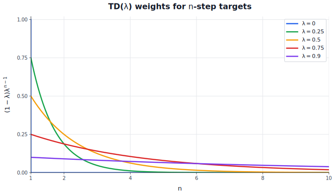

## Introduction

In the previous article, we derived Value Iteration. The update was:

$$
v_{k+1}(s) = \max_a \sum_{r, s^\prime} p(r, s^\prime \mid s, a)(r + \gamma v_k(s^\prime))
$$

This is a model-based update. It assumes that we know the environment dynamics:

$$
p(r, s^\prime \mid s, a)
$$

If this distribution is available, the update can evaluate actions before choosing one. For each possible action $a$ in state $s$, it averages over all possible rewards $r$ and next states $s^\prime$ to compute that action's candidate value. Once every action has been evaluated this way, the outer $\max_a$ selects the best one and uses it to update $v(s)$.

In most real problems, we do not know $p(r, s^\prime \mid s, a)$ in advance. One way forward is to learn this model from data and then plan with it. This is also close to how people often reason: before acting, we imagine what might happen next and whether it will be good or bad. For example, stealing something may lead to getting arrested.

But learning an explicit dynamics model is not trivial. Yann LeCun makes a related point in his work on predictive world models: useful prediction should often happen at a more abstract level than raw pixels. If the state is everything visible on the screen, then predicting the exact next state means predicting the next image pixel by pixel, including details that may not matter for the decision.

To learn in this model-free setup, we need samples from interaction with the environment. They may come from the current agent, another policy, or an existing dataset, but each sample still records what happened along one realized path. We cannot pause in state $s$, try every possible action, observe all possible outcomes, average them, and then go back to choose the best action. Some policy chooses one action, gets one reward, moves to one next state, and the episode continues.

So instead of the exact model-based update, interaction gives us samples from the unknown dynamics. A single transition looks like:

$$
(s, a, r, s^\prime)
$$

Over time, these sampled transitions form trajectories, episodes, or rollouts. This is the data source for the rest of the article. The next question is what we should estimate from those samples so that we can improve a policy.

### Use Q, not V

One tempting idea is to use rollouts to estimate $v(s)$ like we did in previous article. That works for prediction, but it is not enough for control. The reason is simple: $v(s)$ tells us how good state $s$ is under some policy, but it does not tell us which action to choose in that state. In the model-based setting, this was not a problem. If we knew $v(s)$ and the transition model, we could compare actions by computing:

$$
q(s, a) = \sum_{r, s^\prime} p(r, s^\prime \mid s, a)(r + \gamma v(s^\prime))
$$

Then we could improve the policy greedily:

$$
\pi^\prime(s) = \argmax_a q(s, a)
$$

In the model-free setting, this path is blocked. We do not know $p(r, s^\prime \mid s, a)$, so we cannot turn $v(s)$ into action comparisons. Estimating $v(s)$ alone would tell us that a state is good or bad, but not which action made it good or bad. So for model-free control we should learn action-values directly:

$$
q_\pi(s, a) = \mathbb{E}_\pi[G_t \mid S_t = s, A_t = a]
$$

The action-value function answers the question we need for control: if I am in state $s$ and take action $a$, what return should I expect? Once we have an estimate $q(s, a)$, we can extract a greedy policy without a transition model:

$$
\pi^\prime(s) = \argmax_a q(s, a)
$$

That is why the rest of the article focuses on learning $q(s, a)$ from sampled rollouts.

## Estimation methods

Before looking at control algorithms, we first need two ways to estimate $q(s, a)$ from sampled experience.

### Monte Carlo

Monte Carlo learning uses complete episodes. Suppose an episode produces the following trajectory:

$$
S_0, A_0, R_0, S_1, A_1, R_1, \ldots, S_T
$$

The episode ends in terminal state $S_T$. After it finishes, we can compute the realized return from each time step:

$$
G_t = R_t + \gamma R_{t+1} + \gamma^2 R_{t+2} + \ldots + \gamma^{T-t-1}R_{T-1} =  \sum_{k=t}^{T-1} \gamma^{k-t}R_k
$$

For every visited state-action pair $(S_t, A_t)$, this $G_t$ is one sample of the return after taking action $A_t$ in state $S_t$. The estimate $q(s, a)$ does not depend on time; it is tied to the state-action pair. The time index is only needed to identify which sampled return $G_t$ came from the rollout.

To write the estimate without carrying the time index everywhere, let $s = S_t$ and $a = A_t$ for a sampled visit. Across episodes, or even within one episode, the same state-action pair may appear many times, and each visit gives another sampled return. Monte Carlo estimates the action-value by averaging those returns:

$$
q(s, a) = \frac{1}{N(s, a)} \sum_{i=1}^{N(s, a)} G_i(s, a)
$$

Here $N(s, a)$ is the number of observed returns for that state-action pair. We do not need to store all previous episodes to compute this average. When we observe a new return for $(s, a)$, we first increment the count:

$$
N(s, a) \leftarrow N(s, a) + 1
$$

Then we treat the new return as $G_i(s, a)$ and update the running average:

$$
q(s, a) \leftarrow \frac{(N(s, a) - 1)q(s, a) + G_i(s, a)}{N(s, a)}
$$

Equivalently:

$$
q(s, a) \leftarrow q(s, a) + \frac{1}{N(s, a)}(G_i(s, a) - q(s, a))
$$

The cost is that we must wait until the episode finishes. If the episode is very long, or if the task is continuing and does not naturally end, this can be inconvenient. Monte Carlo returns can also have high variance, because a full return may depend on many random events that happen after the current state-action pair. Averaging over more episodes reduces this variance, but it may take many samples.

Sparse rewards make this worse. A reward signal is sparse when most transitions produce zero or uninformative reward, and useful feedback appears only after a rare event. Imagine a game where the agent receives a meaningful reward only after winning. If the initial policy is random, the agent may play many episodes without ever winning, so most sampled returns contain no useful learning signal. In that case Monte Carlo learning may need a large number of samples before it observes even one successful trajectory.

### Temporal Difference

Monte Carlo gives us a clean sampled target, but it has one practical problem: we need to wait for the final return.

Temporal Difference (TD) learning changes the target. Instead of waiting for the complete return $G_t$, it uses the recursive Bellman equation for action-values and bootstraps from the current estimate. This is the same Bellman expectation idea from the previous article, where we used it for $v_\pi$, but unrolled one step further so that the value is attached to a state-action pair. For a fixed policy $\pi$, the equation for $q_\pi$ is:

$$
q_\pi(s, a) = \sum_{r, s^\prime} p(r, s^\prime \mid s, a)
\left(r + \gamma \sum_{a^\prime} \pi(a^\prime \mid s^\prime)q_\pi(s^\prime, a^\prime)\right)
$$

This says: take action $a$ in state $s$, receive reward $r$, move to $s^\prime$, and then follow policy $\pi$ from the next state. If we knew the transition distribution, we could compute that expectation exactly.

With sampled interaction, we do not average over every possible reward, next state, and next action. We observe one reward $r$, one next state $s^\prime$, and then take one next action $a^\prime$. To make a one-step update of $q(s, a)$ using the recursive formula, we need samples:

$$
(s, a, r, s^\prime, a^\prime)
$$

Then the target is:

$$
r + \gamma q(s^\prime, a^\prime)
$$

This target can be used immediately after observing $s^\prime$ and choosing $a^\prime$. That gives us more frequent updates, but the target is noisier in a different way: part of it comes from the current estimate $q(s^\prime, a^\prime)$, which may still be wrong.

The TD update has the same shape as the Monte Carlo running-average update:

$$
q(s, a) \leftarrow q(s, a) + \text{step size} \cdot (\text{target} - q(s, a))
$$

For Monte Carlo, the target was the sampled return $G_i$, and the step size was often $\frac{1}{N(s, a)}$. Here the target is the bootstrapped estimate $r + \gamma q(s^\prime, a^\prime)$. Because this target is noisy and also depends on the current value estimate, we usually use a learning rate $\alpha$ instead of $\frac{1}{N(s, a)}$:

$$
q(s, a) \leftarrow q(s, a) + \alpha \left(r + \gamma q(s^\prime, a^\prime) - q(s, a)\right)
$$

The term in parentheses is the error between the bootstrapped target and the current estimate. Equivalently, the same update can be written as:

$$
q(s, a) \leftarrow (1 - \alpha)q(s, a) + \alpha \left(r + \gamma q(s^\prime, a^\prime)\right)
$$

With a constant $\alpha$, this behaves like an exponential moving average: recent targets receive more weight, but older targets still influence the estimate indirectly through the previous value of $q(s, a)$.

We do not have to update after exactly one step. We can keep the sampled trajectory for longer, collect more real rewards, and only then bootstrap from the current estimate.

The one-step target is:

$$
G_t^{(1)} = R_t + \gamma q(S_{t+1}, A_{t+1})
$$

The two-step target is:

$$
G_t^{(2)} = R_t + \gamma R_{t+1} + \gamma^2 q(S_{t+2}, A_{t+2})
$$

More generally, the $n$-step target is:

$$
G_t^{(n)} = R_t + \gamma R_{t+1} + \ldots + \gamma^{n-1}R_{t+n-1} + \gamma^n q(S_{t+n}, A_{t+n})
$$

The larger $n$ is, the closer the target gets to Monte Carlo. If $n$ reaches the end of the episode, the bootstrap term disappears and the target becomes the full return $G_t$. The smaller $n$ is, the sooner we can update.

TD($\lambda$) combines these $n$-step targets. Do not confuse $n$ and $\lambda$: $n$ can be $1$, $2$, $3$, and so on, while $\lambda$ is a mixing parameter between $0$ and $1$.

Think of $\lambda$ as controlling how quickly the influence of larger $n$ fades. A small $\lambda$ puts almost all of the mixture on the one-step return. A large $\lambda$ lets returns that look farther ahead keep meaningful weight, so the result behaves more like Monte Carlo. A simple way to express this is geometric decay: each successive $n$-step return receives $\lambda$ times the raw weight of the previous one:

$$
1, \lambda, \lambda^2, \lambda^3, \ldots
$$

These raw weights form a geometric series. They decay geometrically, but they do not sum to $1$. For $\lambda < 1$, their sum is:

$$
1 + \lambda + \lambda^2 + \ldots = \frac{1}{1 - \lambda}
$$

So we multiply by $(1 - \lambda)$ to normalize the weights. Mathematically, for $\lambda < 1$, TD($\lambda$) uses the $\lambda$-return, which is a weighted average of $n$-step returns:

$$
G_t^\lambda = (1 - \lambda)\sum_{n=1}^{\infty}\lambda^{n-1}G_t^{(n)}
$$

So the mixture weight assigned to the $n$-step return is:

$$
(1 - \lambda)\lambda^{n-1}
$$

Here, weight means the fraction of the final $\lambda$-return assigned to that particular $n$-step return. It is not the same thing as the reward discount $\gamma$.



The plot shows this weight as a function of $n$. In the algorithm, $n$ is an integer, but the smooth curves make the geometric decay easier to see.

In finite episodic tasks, $\lambda = 1$ is handled as the limiting case where the return becomes the full Monte Carlo return. We will not need the full TD($\lambda$) machinery for basic algorithms, but it is useful to understand the spectrum:

- Monte Carlo waits longer and uses less bootstrapping.
- One-step TD updates sooner and uses more bootstrapping.
- TD($\lambda$) sits between those extremes.

## Exploration

We now have two ways to estimate $q_\pi(s, a)$ from samples: Monte Carlo returns and TD targets, but both methods depend on the samples we actually collect. If the policy never tries action $a$ in state $s$, then we do not get returns or TD targets for $(s, a)$, and we cannot estimate $q(s, a)$ well. As a consequence, the improved policy may never discover actions that would maximize the total discounted reward.

This is another consequence of being model-free. Because we do not know $p(r, s^\prime \mid s, a)$, we cannot reliably predict what an untried action would do. The data-collecting policy therefore has to try alternatives sometimes instead of always choosing the current greedy action. That is exploration.

Before writing control algorithms, we should make action selection explicit. A policy is a rule for choosing actions. It may be deterministic, like:

$$
\pi(s) = \argmax_a q(s, a)
$$

or stochastic, in which case we sample from an action distribution:

$$
a \sim \pi(\cdot \mid s)
$$

The stochastic policy we will use is $\epsilon$-greedy. In each state, look at the current $q(s, a)$ values and find the action that looks best. Most of the time, choose that action. With probability $\epsilon$, choose randomly so that other actions still get tried. The greedy choice exploits the current estimates. The random choice explores actions that may look worse now but could teach us something important. Balancing these two forces is the exploration-exploitation problem.

One downside of constant $\epsilon$-greedy exploration is that we keep paying an exploration cost even after we have learned a good policy. Over time, we want to maximize returns, not keep probing random actions. A common fix is to decay $\epsilon$ over training: start high to explore broadly, then lower it so the agent increasingly exploits what it has learned. That said, in non-stationary environments where the rules or rewards can change over time, keeping some exploration permanently makes sense.

## Generalized Policy Iteration

We now have the ingredients for model-free control:

- An $\epsilon$-greedy policy usually chooses the action with the largest current $q(s, a)$ but still tries other actions.
- Monte Carlo and TD give us ways to estimate $q_\pi(s, a)$ from sampled rollouts.

So far, Monte Carlo and TD were only prediction tools: keep a policy fixed and estimate how good its actions are. For control, we do not need to invent a new framework. We can reuse Policy Iteration from the previous article and run the same two-step loop, now with sampled estimates:

1. Policy evaluation: estimate action-values for the current policy.
2. Policy improvement: make the policy prefer actions with larger estimated values.

The model-based version used the transition dynamics to evaluate a policy. Here we do not have those dynamics, so evaluation has to come from samples. The improvement step also changes slightly: instead of always choosing the action with the largest $q(s, a)$, the policy keeps some random exploration so that training continues to produce useful data.

This is Generalized Policy Iteration (GPI). The two steps are still distinct, but they can be interleaved at different rates. We can evaluate for many episodes and then improve, or we can improve after every small update to $q$. The algorithms below differ mostly in how they evaluate the current policy: from complete returns, from sampled next actions, or from an average over next actions.

### Monte Carlo Control

Monte Carlo Control uses complete returns for the evaluation part. Generate an episode with the current policy, use the observed returns to update $q(s, a)$, then refresh the policy from the new estimates: in each state, the action with the largest $q(s, a)$ becomes the greedy choice, while random exploration with probability $\epsilon$ remains.

A basic version is:

1. Generate an episode using the current policy $\pi$.
2. For each visited pair $(S_t, A_t)$, compute the return $G_t$ from that point in the episode.
3. Update the running average for $q(S_t, A_t)$.
4. After the $q$ update, recompute the greedy action in each state, while keeping probability $\epsilon$ for random exploration.
5. Repeat.

### SARSA

SARSA keeps the same policy-evaluation, policy-improvement loop, but replaces the complete Monte Carlo return with a one-step TD target.

For the one-step target, we need to know which action the policy will take in the next state. So the sampled piece is:

$$
S_t, A_t, R_t, S_{t+1}, A_{t+1}
$$

This is where the name SARSA comes from: state, action, reward, state, action. If the sampled step is $(s, a, r, s^\prime, a^\prime)$, the target is:

$$
r + \gamma q(s^\prime, a^\prime)
$$

and the update becomes:

$$
q(s, a) \leftarrow (1 - \alpha)q(s, a) + \alpha \left(r + \gamma q(s^\prime, a^\prime)\right)
$$

If $s^\prime$ is terminal, there is no next action and no future value, so the target is just:

$$
r
$$

A simple SARSA loop is:

1. Choose $a \sim \pi(\cdot \mid s)$, take it, and observe $r$ and $s^\prime$.
2. If $s^\prime$ is not terminal, choose $a^\prime \sim \pi(\cdot \mid s^\prime)$ using the same policy.
3. Update $q(s, a)$ toward $r + \gamma q(s^\prime, a^\prime)$, or toward $r$ if $s^\prime$ is terminal.
4. After the $q$ update, recompute the greedy action in each state, while keeping probability $\epsilon$ for random exploration.
5. If the episode is not done, set $s \leftarrow s^\prime$, $a \leftarrow a^\prime$, and continue.

The important detail is that $a^\prime$ is sampled from the same policy that is collecting data. If the policy is $\epsilon$-greedy, then the TD target includes the effect of that exploration. SARSA learns the value of the policy it actually follows. That distinction will matter below, when Q-learning deliberately learns about a different policy.

### Expected SARSA

Before moving on, let us go back to something we glossed over in the Bellman expectation equation for $q_\pi$:

$$
q_\pi(s, a) = \sum_{r, s^\prime} p(r, s^\prime \mid s, a)
\left(r + \gamma \sum_{a^\prime} \pi(a^\prime \mid s^\prime)q_\pi(s^\prime, a^\prime)\right)
$$

When we derived the one-step TD update, we replaced the right-hand side with one sampled step $(s, a, r, s^\prime, a^\prime)$. But the two sums in this equation are not the same kind of thing. The outer sum over $r$ and $s^\prime$ is weighted by the environment dynamics $p(r, s^\prime \mid s, a)$, which we do not know. In the model-free setting, we have to replace that part with a sample.

The inner sum over $a^\prime$ is different. It is weighted by the policy $\pi(a^\prime \mid s^\prime)$, and we know both the policy and our current estimate $q$. So nothing forces us to sample one next action $a^\prime$.

SARSA does sample it:

$$
r + \gamma q(s^\prime, a^\prime)
$$

Expected SARSA keeps the action expectation:

$$
r + \gamma \sum_{a^\prime} \pi(a^\prime \mid s^\prime)q(s^\prime, a^\prime)
$$

The update is:

$$
q(s, a) \leftarrow (1 - \alpha)q(s, a) + \alpha \left(r + \gamma \sum_{a^\prime} \pi(a^\prime \mid s^\prime)q(s^\prime, a^\prime)\right)
$$

For a terminal next state, the target is again:

$$
r
$$

The difference is small but useful. SARSA asks which next action the policy happened to sample. Expected SARSA asks for the average value under all actions the policy might sample. That usually gives a lower-variance target. The cost is that we have to know the action probabilities $\pi(a^\prime \mid s^\prime)$ and sum over the available actions, which is cheap when the action set is small and discrete.

The control loop is:

1. Choose $a \sim \pi(\cdot \mid s)$, take it, and observe $r$ and $s^\prime$.
2. Update $q(s, a)$ toward $r + \gamma \sum_{a^\prime} \pi(a^\prime \mid s^\prime) q(s^\prime, a^\prime)$, or toward $r$ if $s^\prime$ is terminal.
3. After the $q$ update, recompute the greedy action in each state, while keeping probability $\epsilon$ for random exploration.
4. Continue from $s^\prime$.

Unlike SARSA, this update does not need to carry a sampled $a^\prime$ forward. The sampled tuple is really $(s, a, r, s^\prime)$: Expected SARSA is, in that sense, Expected SARS. The final "A" is not a sampled action in the update; it is the action distribution inside the expectation.

## On-policy vs. Off-policy

Once the behavior policy includes exploration, we need to separate two ideas:

- The behavior policy is the policy that collects data.
- The target policy is the policy being learned or evaluated.

In on-policy learning, the behavior policy and target policy are the same. The update evaluates the policy that actually acts.

In off-policy learning, they can be different. The agent may behave exploratorily while learning about a greedy target policy.

Monte Carlo Control, SARSA, and Expected SARSA are on-policy in the versions above: the same policy collects data and defines the evaluation target. Q-learning is off-policy: the behavior policy can explore, but the update target is greedy.

### Q-learning

Q-learning is closer in spirit to Value Iteration, but for action-values instead of state-values. Instead of evaluating the behavior policy, it uses the Bellman optimality equation. For the optimal action-value function, the policy average from the Bellman expectation equation is replaced by a maximum:

$$
q^*(s, a) = \sum_{r, s^\prime} p(r, s^\prime \mid s, a)
\left(r + \gamma \max_{a^\prime} q^*(s^\prime, a^\prime)\right)
$$

This says: take action $a$ first, and after that behave optimally. It also gives us an action-value version of Value Iteration:

$$
q_{k+1}(s, a) = \sum_{r, s^\prime} p(r, s^\prime \mid s, a)
\left(r + \gamma \max_{a^\prime} q_k(s^\prime, a^\prime)\right)
$$

This is the same idea as Value Iteration from the previous article, but now the table is indexed by state-action pairs instead of only states.

The formula still contains the transition probabilities, so this exact update is still model-based. In the model-free setting, one sampled transition:

$$
(s, a, r, s^\prime)
$$

replaces the expectation over all possible outcomes. The sampled optimality target is:

$$
r + \gamma \max_{a^\prime} q(s^\prime, a^\prime)
$$

The update is:

$$
q(s, a) \leftarrow (1 - \alpha)q(s, a) + \alpha \left(r + \gamma \max_{a^\prime} q(s^\prime, a^\prime)\right)
$$

For a terminal next state, the target is just:

$$
r
$$

Unlike the SARSA target, this target assumes greedy behavior from the next state, even if the action that produced the transition was chosen by an exploratory behavior policy.

A Q-learning control loop looks like this:

1. Choose $a$ in state $s$ using the behavior policy. For example, usually choose the action with the largest current $q(s, a)$, but explore randomly with probability $\epsilon$.
2. Take $a$, observe $r$ and $s^\prime$.
3. Update $q(s, a)$ toward $r + \gamma \max_{a^\prime} q(s^\prime, a^\prime)$.
4. After the $q$ update, recompute which actions the behavior policy treats as greedy.
5. Continue from $s^\prime$.

Q-learning is different from Monte Carlo because it updates after one transition. It is different from model-based Value Iteration because it does not sum over all possible next states. It uses only the next state that actually happened. If the estimate becomes accurate, the greedy policy:

$$
\pi^\prime(s) = \argmax_a q(s, a)
$$

approximates an optimal policy.

This also closes the loop with Expected SARSA. SARSA, Expected SARSA, and Q-learning differ only in what they do with the next-action distribution inside the target:

- SARSA samples one $a^\prime$ from the policy.
- Expected SARSA averages over $a^\prime$ under the policy.
- Q-learning takes the maximum.

The maximum is just the expectation under a greedy policy. So if Expected SARSA put all of the policy's probability on the greedy action:

$$
\sum_{a^\prime} \pi(a^\prime \mid s^\prime)q(s^\prime, a^\prime)
= \max_{a^\prime} q(s^\prime, a^\prime)
$$

its target would become exactly the Q-learning target. With an exploratory policy, Expected SARSA stays closer to SARSA because it keeps evaluating the policy that may actually explore.

## Exercise: Cliff Walking

Consider the standard Cliff Walking environment:

```text
F F F F F F F F F F F F
F F F F F F F F F F F F
F F F F F F F F F F F F
S C C C C C C C C C C G
```

Here $S$ is the start, $G$ is the goal, $F$ is a normal floor cell, and $C$ is the cliff. The agent can move up, down, left, or right. Each normal step gives reward $-1$. Stepping into the cliff gives reward $-100$ and sends the agent back to the start. Reaching the goal ends the episode.

There are two important routes:

- The shortest good route goes just above the cliff and then down into the goal.
- A safer route goes higher above the cliff, so random mistakes are less likely to fall into it.

This example shows why the behavior-policy/target-policy distinction matters. Q-learning learns the value of the greedy target policy. That greedy policy tends to choose the shortest route just above the cliff. During training, the behavior policy may still make exploratory mistakes and fall, but the learned target is the path that would be good if the agent behaved greedily afterward.

SARSA evaluates the policy that actually acts. If that policy is $\epsilon$-greedy, then it still sometimes makes exploratory moves. Near the cliff, one exploratory mistake can be very costly, so SARSA may prefer a safer route farther from the cliff.

## Summary

Value Iteration works cleanly in a model-based setting because the transition probabilities let us compute exact Bellman backups and compare actions before acting. In a model-free setting, the agent chooses one action, observes one outcome, and moves on. Exact expectations are replaced by samples collected from interaction.

Monte Carlo learning uses complete returns from finished episodes. Temporal Difference learning updates after each step by bootstrapping from current estimates.

For control, learning only $v(s)$ is a dead end when we do not know the transition model. We learn $q(s, a)$ so that actions can be selected directly with:

$$
\pi^\prime(s) = \argmax_a q(s, a)
$$

Generalized policy iteration describes the control loop: estimate action-values, improve the policy, and repeat without requiring either step to finish exactly. Monte Carlo Control does the evaluation part with complete returns. SARSA does it with a one-step TD target sampled from the same policy. Q-learning uses the Bellman optimality target and learns toward $q^*$.

Exploration is needed because, without environment dynamics, the agent can only learn from actions it actually tries. An $\epsilon$-greedy behavior policy keeps collecting useful samples while still exploiting what the agent already knows.

Once behavior can differ from the policy being learned, the on-policy/off-policy distinction matters. SARSA is on-policy because it learns from the next action sampled by the same exploratory policy. Q-learning is off-policy because it can behave exploratorily while learning a greedy target policy. Expected SARSA replaces SARSA's sampled next action with an expectation over the next-action distribution.

### Towards Deep Q-learning

So far $q(s, a)$ was treated as a table. That is enough for small environments, but it will not scale to images, continuous state vectors, or very large state spaces. Neural networks can address this scaling problem by approximating action-values with parameters $\theta$:

$$
q_\theta(s, a)
$$

Once we do that, the algorithm needs extra machinery. Neural networks are sensitive to correlated data, and Q-learning targets move as the network changes. This is where experience replay and target networks become important. We will cover those ideas in the next article when we move from tabular Q-learning to Deep Q-Networks.
