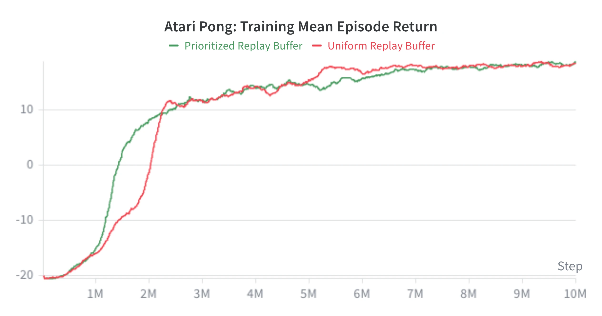
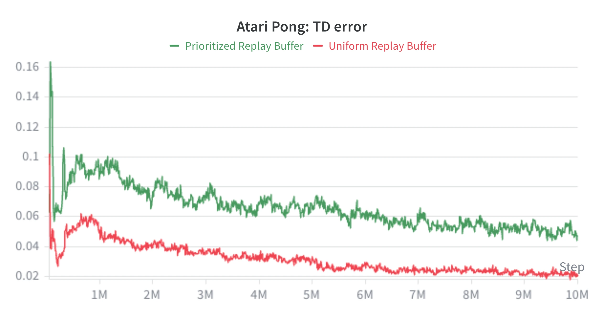

## Introduction

In the previous article, we replaced the tabular action-value function $q(s, a)$ with a parameterized approximation: $q_\theta(s, a)$. We will use neural networks to approximate $q_\theta(s, a)$.

Deep Q-Network (DQN) is the version of approximate Q-learning that made it practical at a scale. When we combine Q-learning with neural networks, then we must deal with the instability created by correlated data, moving targets, changing behavior distributions, and large TD errors. This article presents solutions to deal with those problems.

Before we continue, we need to understand why we moved forward with approximate Q-learning, not approximate SARSA or Expected SARSA.

### Why not SARSA?

SARSA is an on-policy algorithm. It learns the value of the policy that is currently acting. Its target uses the actual next action $a^\prime$, which should be sampled from the current policy:

$$
r + \gamma q_\theta(s^\prime, a^\prime)
$$

If we collect and store transitions and train on them later, that next action may have been sampled from an older policy. The update is then no longer strictly on-policy. To stay faithful to SARSA, we need fresh data from the current policy, or at least data that is not too stale. This limits how freely we can reuse stored experience.

There is another issue. In the tabular case, SARSA can be understood through generalized policy iteration: evaluate the current policy, then improve it by acting greedily with respect to the learned values. With neural networks, this story becomes less clean. A gradient update on a batch is only a partial policy-evaluation step on the states and actions we sampled. It does not give us a reliable global estimate of $q^\pi$. At the same time, the policy is derived from the same changing $q_\theta$, so the policy may change before evaluation has caught up.

This makes approximate SARSA awkward. It needs fresh on-policy data to evaluate a moving policy, while policy improvement happens only indirectly through changes in the approximate action-value function.

Q-learning is off-policy. The behavior policy that collects data can be different from the target policy being learned. This means the agent can explore with an $\epsilon$-greedy policy, store transitions in a replay buffer, and later reuse them for training.

This fits neural-network training better than strict on-policy value learning. One environment interaction can be reused in many gradient updates, and random batches from a replay buffer are less correlated than consecutive game frames. This does not mean off-policy learning is always better. It means off-policy control is compatible with replay, and replay is very useful when training neural networks.

What about off-policy Expected SARSA? Its target is:

$$
r + \gamma \sum_{a^\prime} \pi(a^\prime \mid s^\prime) q_\theta(s^\prime, a^\prime)
$$

If the target policy is $\epsilon$-greedy, then Expected SARSA learns values for a policy that continues to explore in the future. Those values include the cost of future random exploratory actions. This can be useful if we want to keep exploring after learning the best policy e.g. in non-stationary environment. In our case we explore to discover useful transitions, but after training we usually want to act greedily and make the best decision according to the learned values and keep winning games!

Therefore, we do not necessarily want $q_\theta$ to encode the long-term cost of future exploratory actions. We want it to approximate the value of the greedy policy we would like to deploy. This is exactly what Q-learning does.

$$
r + \gamma \max_{a^\prime} q_\theta(s^\prime, a^\prime)
$$

So have we established that off-policy methods are always better than on-policy methods? Not quite. On-policy actor-critic methods (more on them later) can also work very well with neural networks. For example A3C avoided replay buffer by using many parallel actors. Instead of decorrelating data with a replay buffer, it decorrelated data with many environments running asynchronously. SARSA could also do that, the difference is how the policy is improved.

Now, let's go back to DQN and problems we outlined in the previous article.

## Problem 1: Correlated Data

Stochastic gradient descent works best when batches give a useful estimate of the training objective. In supervised learning, we sample examples independently from the same training distribution and use the minibatch gradient as an unbiased estimate of the expected gradient:

$$
\nabla_\theta J(\theta) = \mathbb{E}_X[\nabla_\theta L(X, \theta)] \approx
\frac{1}{B}\sum_{i=1}^{B}\nabla_\theta L(X_i, \theta)
$$

Consecutive RL samples are not like independently sampled training examples. During one episode, adjacent states are strongly correlated.

Imagine an agent watching the ball move across the screen. Frame $t$ and frame $t+1$ are almost the same. If we train directly on the latest transition at every step, the network sees a long stream from one small region of experience. The gradient points too strongly toward what just happened and too weakly toward the broader game.

There is also a distribution problem. In supervised learning, the dataset is usually fixed. In RL, the behavior policy creates the data. If $q_\theta$ changes, then an $\epsilon$-greedy policy may choose different actions and reach different states. If we train only on the newest transitions, the training distribution can immediately become dominated by whatever the current policy just visited, instead of staying stable and well mixed.

### Experience Replay

DQN appends each transition to a replay buffer $\mathcal{D}$ and trains on random batches $B$ sampled from it. This helps in several ways.

$$
\{(s_i, a_i, r_i, s_i^\prime)\}_{i=1}^{B} \sim \mathcal{D}
$$

1. It breaks short-term correlations. A random batch may contain transitions from different episodes, different game situations, and different moments in training. The samples are not truly independent, but they are much less correlated than consecutive frames.

2. It improves data efficiency. One transition can be used in many gradient updates of our neural network. This matters because environment interaction is often the expensive part.

3. It slows sudden shifts in what the network trains on. This makes learning more stable: a small change in the current policy does not immediately replace the whole training batch with new, similar transitions.

Other way to think about replay batch is that it can be viewed as a sample-based model of the world. A real model would estimate:

$$
p(r, s^\prime \mid s, a)
$$

and let us ask what would happen for arbitrary state-action pairs. A replay buffer does not do that. It cannot generate new transitions for states and actions we never tried, but it is a non-parametric collection of one-step samples from the environment.

What are disadvantages of replay?

1. If a replay buffer is large, then it is memory intensive. For Atari, one `uint8` grayscale frame is $84 \times 84 = 7{,}056$ bytes. A transition contains $s_t$ and $s_{t+1}$, each a stack of 4 frames, so naive storage needs $8 \times 7{,}056 = 56{,}448$ bytes per transition i.e. ~56GB for $1M$ transitions. Practical buffers avoid most of this duplication by storing frames once and reconstructing overlapping states, which is why Atari replay buffers are often closer to ~6-7GB.

2. Uniform random sampling to form a batch is not optimal as it treats all transitions as equally useful. In reality, some transitions have larger TD errors or contain rare rewards. Prioritized replay improves this idea by sampling more informative transitions more often, but vanilla DQN uses uniform sampling.

3. Replay trains on transitions collected by older versions of the policy. Q-learning can use them because it is off-policy, but too much old experience can slow adaptation when the current policy starts reaching different states.

## Problem 2: Moving Targets

Experience replay helps with correlated data, but it does not solve the moving target problem. In approximate Q-learning, the target is:

$$
y(\theta) = r + \gamma \max_{a^\prime}q_\theta(s^\prime, a^\prime)
$$

In the previous article, we established that we use semi-gradients for targets $y(\theta)$, so during one gradient update the target is treated as fixed. However, this is not enough. Once we update the network parameters $\theta$, the target $y(\theta)$ also changes, because the same network is used both to predict $q_\theta(s,a)$ and to build the bootstrap target $y(\theta)$.

Why is this a problem? Is it because the target is wrong? No. Bootstrap targets are usually wrong. That is expected. For example, consider the scalar recursive equation:

$$
q = 1 + 0.9q
$$

The true solution is:

$$
q^* = 10
$$

Suppose we start from $q_0 = 0$. It does not matter that $q_0$ is wrong. If we keep applying the update:

$$
q_{k+1} = 1 + 0.9q_k
$$

we get:

$$
q_1 = 1,\quad q_2 = 1.9,\quad q_3 = 2.71,\dots
$$

Every intermediate value is wrong, but the sequence still moves toward the fixed point. That is the core idea behind the Bellman optimality equation, contraction mappings, and the Banach fixed-point theorem. The target does not need to be correct at every step. It only needs to be a useful next approximation.

The problem in DQN is different. We are not applying the exact recursive equation to the whole action-value function. We are learning from finite, noisy samples using gradient descent. If we just use a noisy sample to update $q_k$, then training might behave in a very unpredictable way. Ideally, we would like to do something closer to this:

1. Keep an old action-value function $q_0$ fixed.
2. Use many noisy samples and many gradient updates to learn a better approximation $q_1$.
3. Once $q_1$ has been fitted reasonably well, replace $q_0$ with $q_1$.
4. Repeat the process.

In other words, we do not want the target to change every time the online network takes a single gradient step. We want to hold the previous approximation fixed for a while, train the new approximation against it, and only then move to the next step of the recursive process. It is then more similar to how recursive Bellman optimality equations work.

### Target Network

To apply this idea in practice, DQN introduces a second neural network called the target network, with parameters $\theta^-$. DQN separates the network being trained from the network used to build the bootstrap target.

There are two networks:

- The online network $q_\theta$, updated by gradient descent.
- The target network $q_{\theta^-}$, used to compute bootstrap targets.

The target becomes:

$$
y =
\begin{cases}
r, & \text{if } s^\prime \text{ is terminal} \\
r + \gamma \max_{a^\prime}q_{\theta^-}(s^\prime, a^\prime), & \text{otherwise}
\end{cases}
$$

The online network is still trained with batches $B$ sampled from a replay buffer.

$$
L(\theta) = \frac{1}{B}\sum_{i=1}^{B} \frac{1}{2}\left(y_i - q_\theta(s_i, a_i)\right)^2
$$

During these gradient updates, the target network parameters $\theta^-$ are held fixed. This means the online network is repeatedly trained against targets generated by the same fixed action-value approximation. Then periodically, the online network copies its parameters to the target network:

$$
\theta^- \leftarrow \theta
$$

Conceptually, the target network plays the role of the old approximation $q_0$. The online network tries to learn a better approximation $q_1$ using many noisy samples and gradient updates. After some time, $q_1$ becomes the new fixed reference point, and the process continues. This makes training less reactive to noisy samples and closer in spirit to approximate value iteration, although there are still no convergence guarantees like in the tabular setting.

## Problem 3: Unstable Gradients

The TD error for one transition is:

$$
\delta = y - q_\theta(s, a)
$$

For squared loss, the gradient has the form:

$$
\nabla_\theta L(\theta)
= -\delta \nabla_\theta q_\theta(s, a)
$$

So the size of the TD error directly scales the update. Since action-values estimate discounted sums of rewards, larger reward scales lead to larger target values and larger TD errors. If rewards have very different magnitudes across games, then the same learning rate can be too small for one game and too large for another.

### Reward Clipping

DQN clips rewards to:

$$
r \in [-1, 1]
$$

It makes true optimal Q-values bounded by roughly:

$$
\frac{1}{1 - \gamma}
$$

For $\gamma = 0.99$, that is $100$. This gives good gradients in a pragmatic sense: the TD errors are kept in a range where one learning rate can work across many games. Without clipping, the scale can be much larger and very different across games.

Reward clipping has also a cost. If one action gives reward $+1$ and another gives reward $+100$, clipping makes both immediate rewards equal to $+1$. The agent can no longer distinguish good rewards from great rewards at that time step. It learns from signs and frequencies more than from exact reward magnitudes. So reward clipping is more like an engineering trick to make learning process stable.

## Vanilla DQN

Now we can combine all these ideas and implement a basic DQN training algorithm.

1. Initialize the online network $q_\theta$.
2. Initialize the target network with the same parameters: $\theta^- \leftarrow \theta$.
3. Initialize a replay buffer $\mathcal{D}$.
4. Act with an $\epsilon$-greedy behavior policy based on $q_\theta$.
5. Store each transition $(S_t, A_t, R_t, S_{t+1})$ in $\mathcal{D}$.
6. Sample a batch from $\mathcal{D}$.
7. For each sampled transition, compute:

$$
y_i =
\begin{cases}
r_i, & \text{if } s_i^\prime \text{ is terminal} \\
r_i + \gamma \max_{a^\prime} q_{\theta^-}(s_i^\prime, a^\prime), & \text{otherwise}
\end{cases}
$$

8. Update $\theta$ by minimizing loss function:

$$
L(\theta) =
\frac{1}{B}\sum_{i=1}^{B}
\frac{1}{2}\left(y_i - q_\theta(s_i, a_i)\right)^2
$$

9. Periodically update the target network with a hard copy of the online network.

$$
\theta^- \leftarrow \theta
$$

This is DQN: approximate Q-learning with replay buffer, a target network, and reward clipping.

### Tips & Tricks

There are a few practical issues that can show up when training DQN on Atari games.

1. Store frames as `uint8` in the replay buffer to save memory, then convert and normalize them on the GPU:

```python
states = states.to(self.device).float().div_(255.0)
```

2. If learning stalls early, check the gradient norms. In my runs, very small gradients with Adam made the model fail to learn. Using a larger Adam epsilon helped:

```python
self.optimizer = Adam(self.policy_network.parameters(), lr=config.learning_rate, eps=1e-4)
```

3. I also used `LeakyReLU` instead of `ReLU` in the convolutional neural network to avoid dying ReLU neurons.

```python
nn.LeakyReLU(negative_slope=0.01)
```

4. Atari environments return both `terminated` and `truncated`. Only true terminations should stop bootstrapping; time-limit truncations can still use the next-state Q-value.

```python
transition = Transition(state=state, action=action, reward=clipped_reward, next_state=next_state, done=terminated)
```

### Atari Pong Demo

Pong is a two-player Atari game. Here, vanilla DQN uses a Convolutional Neural Network that sees the state as the last four frames stacked together. After about 10 hours of training on a MacBook, the learned policy controls the paddle on the right and starts exploiting certain strategies that feel like reward hacking.


<video autoplay muted loop playsinline preload="metadata" style="display: block; width: 360px; max-width: 100%; height: auto; margin: 0 auto;">

  <source src="dqn_output.webm" type="video/webm">
  <source src="dqn_output.mp4" type="video/mp4">
</video>


### Implementation

Feel free to take a look at [my implementation on GitHub](https://github.com/elkotito/dqn-implementations). I recommend implementing it yourself rather than having an agent do it. It is the best way to learn.

## Prioritized Replay Buffer

Uniform replay treats every stored transition as equally useful. That is simple and it already helps a lot, but it is not how learning usually feels. Some transitions are boring because the network already predicts them well. Others are surprising: the reward was unexpected, the state was rare, or the bootstrap target disagrees strongly with the current estimate. The TD error gives us a simple way to measure that surprise:

$$
\delta_i = y_i - q_\theta(s_i, a_i)
$$

If $|\delta_i|$ is large, then transition $i$ currently creates a large learning signal. Prioritized replay uses this idea by sampling those transitions more often than transitions with small TD errors. A common priority is:

$$
p_i = |\delta_i| + \epsilon
$$

where $\epsilon > 0$ keeps every transition sampleable. Without this small constant, a transition with zero priority might never be seen again, even though it could become useful later after the network changes. Then the sampling probability is:

$$
P(i) = \frac{p_i^\alpha}{\sum_j p_j^\alpha}
$$

The parameter $\alpha$ controls how much prioritization we use. If $\alpha = 0$, then $p_i^\alpha = 1$ for every transition, so we end up with uniform replay. If $\alpha$ is larger, high-error transitions are sampled more often. In practice, a common choice is $\alpha = 0.6$. It is enough to prefer high-error transitions, but not so aggressive that the replay buffer is dominated only by the largest errors.

So we changed our sampling distribution. How does that affect the gradient? Before, in uniform replay, we sampled uniformly from the $N$ stored transitions:

$$
P_{\text{Uniform}}(i) = \frac{1}{N}
$$

With uniform replay, the expected minibatch gradient estimates the average gradient over the whole buffer:

$$
\nabla_\theta J(\theta)
\approx
\frac{1}{N}\sum_{i=1}^{N}\nabla_\theta L_i(\theta)
$$

Prioritized replay samples transition $i$ with probability $P(i)$ instead, so before correction the expectation becomes:

$$
\nabla_\theta J(\theta) \approx \sum_{i=1}^{N}P(i)\nabla_\theta L_i(\theta)
$$

That is the bias introduced by prioritized sampling. High-priority transitions are no longer just seen more often, but they also count more in expectation. To correct that bias, multiply each sampled gradient by the ratio between its uniform probability and its prioritized probability:

$$
\frac{1}{N \cdot P(i)}
$$

Then the weighted prioritized gradient becomes the uniform replay gradient again:

$$
\nabla_\theta J(\theta)
\approx
\sum_{i=1}^{N}
P(i)\frac{1}{N \cdot P(i)}\nabla_\theta L_i(\theta)
= \frac{1}{N}\sum_{i=1}^{N}\nabla_\theta L_i(\theta)
$$

This may look like it removes the benefit of prioritized replay, but it does not. The bias correction changes the weight of a transition after it has already been sampled. It does not make the sampling process uniform again. High-priority transitions are still selected more often, so the agent spends more updates looking at them.

Implementation-wise, we still need a way to sample high-priority transitions efficiently. More on that in the next section, but once we have these high-priority samples in the batch, we correct the bias by weighting their losses. For the full correction, the weight is:

$$
w_i = \frac{1}{N \cdot P(i)}
$$

In PyTorch, this just means computing a per-sample loss for each sampled transition $i_k$, multiplying it by its weight, and then averaging over the batch:

$$
L(\theta) =
\frac{1}{B}\sum_{k=1}^{B}
w_{i_k} \frac{1}{2}\left(y_{i_k} - q_\theta(s_{i_k}, a_{i_k})\right)^2
$$

The factor $\frac{1}{B}$ is only the minibatch average. The bias correction still uses $N$ because $P(i)$ is a sampling probability over the replay buffer.

The weights $w_i$ are coefficients on the per-sample losses, but because the final scalar loss is weighted, the gradients with respect to $\theta$ are weighted too.

In practice, Prioritized Replay Buffer often does not use the full correction immediately. It introduces a parameter $\beta$:

$$
w_i = \left(\frac{1}{N \cdot P(i)}\right)^\beta
$$

Here $N$ is the number of transitions in the replay buffer. The parameter $\beta$ controls how strongly we correct the sampling bias. If $\beta = 0$, there is no bias correction. If $\beta = 1$, the bias correction is full.

Sometimes we intentionally want stronger gradients from high-priority samples. Early in training, the policy, targets, and priorities are changing quickly, and high-error transitions often contain the useful signal the network is currently missing. If we fully correct the bias immediately, many of those transitions are downweighted after we sampled them. That can make prioritization less aggressive exactly when we want it to move learning quickly.

So Prioritized Replay Buffer usually starts with weaker correction, for example $\beta = 0.4$, and anneals $\beta$ upward toward $1.0$ during training. Later, as the value estimates become more stable, stronger correction reduces the extra influence of high-priority samples and makes the update less biased relative to uniform replay.

### Training Curves

Here is one Pong run comparing uniform replay with prioritized replay. The prioritized replay agent reaches positive returns earlier, although both runs end up close after enough environment steps.



Since high-priority transitions appear more often in batches, the sampled batch TD error can stay higher while the policy improves.



### Implementation

The replay buffer itself can still be a normal circular buffer: arrays for states, actions, rewards, next states, and done flags. The extra part is one priority per stored transition. The algorithm is straightforward:

1. Sample a priority-weighted batch from the replay buffer.
2. Train on that batch and compute the TD error for each sampled transition.
3. Convert each TD error into a new priority.
4. Store that priority next to the transition in the regular replay buffer.

New transitions do not have a TD error yet, so they usually get the current maximum priority. That makes sure they can be sampled at least once.

The naive sampling approach is to build a probability distribution over the current buffer from these priorities, then sample from that distribution. This works, but it requires scanning across the priority array. Sampling one transition is $O(N)$, so a batch can become expensive for large replay buffers.

A sum tree is a data structure that makes this weighted sampling efficient. It stores priority sums in a binary tree, so we can sample a transition in $O(\log N)$ instead of scanning the whole buffer. Adding a new transition or updating an existing priority is also $O(\log N)$.

The actual transitions do not live in the tree. The tree only maps priority mass to replay-buffer indices. The replay buffer can still overwrite old transitions in circular order. When slot $i$ is overwritten, we also replace the tree entry for slot $i$ with the new transition's priority.

For the implementation details, see my [prioritized replay buffer code](https://github.com/elkotito/dqn-implementations/blob/main/src/buffers/prioritized_replay_buffer.py).

## Overestimation Bias

Target networks made the bootstrap target change more slowly, so we could apply Bellman optimality equations with more confidence and less noise. I also mentioned that target estimates were always wrong, but it was fine, because that was the nature of recurrent Bellman updates.

Though, you can also imagine that if targets were perfectly correct, then the algorithm would converge much faster. Before we try, let's first understand what is wrong with our target estimate.

For one sampled non-terminal transition, the ideal target for that sample would be:

$$
y^* =
r + \gamma \max_{a^\prime}q^*(s^\prime, a^\prime)
$$

DQN does not know $q^*$ so it trains on the estimate:

$$
\hat y =
r + \gamma \max_{a^\prime}\hat q_{\theta^-}(s^\prime, a^\prime)
$$

During that gradient update, $\hat y$ is just a fixed number. Below is a mathematical analysis of fixed target-network action-value estimates being noisy estimates of the true action-values.

For each next action $a^\prime$, write the target-network estimate as the true action-value plus an estimation error $\epsilon_{a^\prime}$.

$$
\hat q_{\theta^-}(s^\prime, a^\prime)
= q^*(s^\prime, a^\prime) + \epsilon_{a^\prime},
\qquad
\mathbb{E}_\epsilon[\epsilon_{a^\prime}] = 0
$$

Then each next action-value estimate is correct on average:

$$
\mathbb{E}_\epsilon[\hat q_{\theta^-}(s^\prime, a^\prime)]
= \mathbb{E}_\epsilon[q^*(s^\prime, a^\prime) + \epsilon_{a^\prime}]
= q^*(s^\prime, a^\prime) + \mathbb{E}_\epsilon[\epsilon_{a^\prime}]
= q^*(s^\prime, a^\prime)
$$

Based on that, if we averaged out the noise before taking the max, the max term would match the true optimal value of the sampled next state:

$$
\max_{a^\prime}
\mathbb{E}_\epsilon[\hat q_{\theta^-}(s^\prime, a^\prime)] =
\max_{a^\prime}q^*(s^\prime, a^\prime)
$$

That is the reference we would want the max term to match. If the max term were equal to this quantity, then the target estimate $\hat y$ would be an unbiased estimator of $y^*$:

$$
\mathbb{E}_\epsilon[\hat y] = y^*
$$

Unfortunately, the actual DQN target maximizes the noisy estimates before averaging, so $\mathbb{E}_\epsilon[\hat y] \neq y^*$. It means that the target estimate $\hat y$ is a biased estimator of $y^*$.

$$
\mathbb{E}_\epsilon[\hat y]
= \mathbb{E}_\epsilon\left[
r + \gamma \max_{a^\prime}\hat q_{\theta^-}(s^\prime, a^\prime)
\right] = r + \gamma
\mathbb{E}_\epsilon\left[
\max_{a^\prime}\hat q_{\theta^-}(s^\prime, a^\prime)
\right]
$$

$$
y^* = r + \gamma \max_{a^\prime} q^*(s^\prime, a^\prime) = r + \gamma \max_{a^\prime} \mathbb{E}_\epsilon[\hat q_{\theta^-}(s^\prime, a^\prime)]
$$

$$
\mathbb{E}_\epsilon[\hat y] \ge y^*
$$

We don't achieve the desirable unbiased estimator, because the estimate from DQN is larger. That's why we call it overestimation bias.

$$
\mathbb{E}_\epsilon\left[
\max_{a^\prime}\hat q_{\theta^-}(s^\prime, a^\prime)
\right]
\geq
\max_{a^\prime}
\mathbb{E}_\epsilon[\hat q_{\theta^-}(s^\prime, a^\prime)]
$$

This follows from Jensen's inequality, because the max over actions is a convex function of the action-value vector.

For a tiny example, assume two actions have true value $0$, and each estimate is independently either $-1$ or $+1$ with equal probability. Each row below has probability $\frac{1}{4}$.


<div class="centered-table">


| $\hat q_1$ | $\hat q_2$ | $\max(\hat q_1, \hat q_2)$ |
| :--------: | :--------: | :------------------------: |
|    $-1$    |    $-1$    |            $-1$            |
|    $-1$    |    $+1$    |            $+1$            |
|    $+1$    |    $-1$    |            $+1$            |
|    $+1$    |    $+1$    |            $+1$            |


</div>


If we average before the max, there is no overestimation:

$$
\mathbb{E}[\hat q_1] = 0,\quad
\mathbb{E}[\hat q_2] = 0,\quad
\max_i \mathbb{E}[\hat q_i] = 0
$$

If we take the max before averaging, there is:

$$
\mathbb{E}[\max(\hat q_1, \hat q_2)]
= \frac{-1 + 1 + 1 + 1}{4}
= 0.5
$$

A takeaway is that DQN can learn values that are too high, not because the rewards or true next-state values are high, but because the bootstrap target repeatedly selects action estimates with positive error terms $\epsilon_{a^\prime}$.

### Double DQN

In the overestimation section, the bad term was:

$$
\mathbb{E}\left[
\max_{a^\prime}\hat q_{\theta^-}(s^\prime, a^\prime)
\right]
$$

Double DQN changes this by not using target network to choose the action whose value will appear in the target and start using online network instead.

The online network $q_\theta$ chooses the next action:

$$
a_\theta = \argmax_{a^\prime} q_\theta(s^\prime, a^\prime)
$$

The target network $q_{\theta^-}$ evaluates that selected action:

$$
y^{\text{Double DQN}} =
\begin{cases}
r, & \text{if } s^\prime \text{ is terminal} \\
r + \gamma q_{\theta^-}(s^\prime, a_\theta), & \text{otherwise}
\end{cases}
$$

So the max is still there, but it is only used to choose an action index:

$$
q_{\theta^-}\left(
s^\prime,
\argmax_{a^\prime} q_\theta(s^\prime, a^\prime)
\right)
$$

As you can see, the target-network value used to evaluate the selected action is not the maximum anymore, but the value at the index selected by the online network. Having said that, if we condition on the action selected by the online network, then maximization bias disappears:

$$
\mathbb{E}_{\epsilon^-}\left[
\hat y \mid a_\theta
\right] = r + \gamma
\mathbb{E}_{\epsilon^-}\left[
q_{\theta^-}(s^\prime, a_\theta)
\right]
= r + \gamma q^*(s^\prime, a_\theta) = y^*
$$

You might say that the online network can be noisy too. You are right. In the expectation above we assumed that a decision $a_\theta$ was already made and we computed expectation for $\epsilon^-$.

Let's go back to the tiny two-action example from the previous section where $q^*(a_1)=q^*(a_2)=0$. Now let $\epsilon^\theta_i$ be the online-network error for action $a_i$, and let $\epsilon^-_i$ be the target-network error.

The online network selects one of the two actions:

$$
a_\theta
= \argmax_a q_\theta(s^\prime, a)
= \argmax(\epsilon^\theta_1,\epsilon^\theta_2)
$$

The target network evaluates that selected action:

$$
q_{\theta^-}(s^\prime, a_\theta)
= \epsilon^-_{a_\theta}
$$

Now average the Double DQN value. The selected action $a_\theta$ is determined by the online-network errors $\epsilon^\theta_1$ and $\epsilon^\theta_2$.

$$
\begin{aligned}
\mathbb{E}[q_{\theta^-}(s^\prime, a_\theta)]
&= \mathbb{E}[\epsilon^-_{a_\theta}]
&& {\scriptsize\text{(because } q^*(a_1)=q^*(a_2)=0 \text{)}} \\[0.5em]
&= P(a_\theta=a_1)\mathbb{E}[\epsilon^-_1 \mid a_\theta=a_1] + P(a_\theta=a_2)\mathbb{E}[\epsilon^-_2 \mid a_\theta=a_2]
&& {\scriptsize\text{(law of total expectation)}} \\[0.5em]
&= P(a_\theta=a_1)\mathbb{E}[\epsilon^-_1] + P(a_\theta=a_2)\mathbb{E}[\epsilon^-_2]
&& {\scriptsize\text{(selection is independent of target noise)}} \\[0.5em]
&= P(a_\theta=a_1)\cdot 0 + P(a_\theta=a_2)\cdot 0
&& {\scriptsize\text{(zero-mean target-network errors)}} \\[0.5em]
&= 0
\end{aligned}
$$

This equation tells us that, if the target-network noise is independent of the noise that selected the action, the target network does not add a positive error on average just because an action was selected.

This independence is the key assumption. The noise $\epsilon^\theta$ used to select the action should be independent of the noise $\epsilon^-$ used to evaluate that action. In practice the two networks are not fully independent, because $\theta^-$ is periodically copied from $\theta$. Having said that, Double DQN reduces this overestimation bias rather than removing it completely.

<!--## Dueling DQN

A normal DQN directly predicts one value per action:

$$
q_\theta(s, a)
$$

However in many states, knowing that the state is good or bad is easier than knowing the exact best action. Imagine Pong when the ball is on the opposite side of the screen. Moving the paddle up, down, or doing nothing for one frame may lead to almost the same long-term outcome. One slightly bad move does not decide the point, because there is still time to correct. In that kind of state, the action-values share a large common part: the position is either generally promising or generally dangerous, regardless of the exact next action. There are also make-or-break states. If the ball is about to pass the paddle, then moving in the correct direction and moving in the wrong direction can have very different values. In those states, the action-specific part matters a lot.

A normal DQN does share hidden layers across actions, so the action outputs are not completely independent. Still, the last layer has to output the full value for every action. Dueling DQN makes the decomposition explicit by representing action-values with two streams:

- A state-value stream $v_\theta(s)$, which outputs one number.
- A raw advantage stream $\tilde A_\theta(s, a)$, which outputs one number per action.

The value stream tries to capture the common part: how good this state is before caring too much about the exact action. The advantage stream captures the action-dependent residual: which actions are better or worse than the others in this state.

Conceptually, the advantage of an action under a policy $\pi$ is:

$$
A^\pi(s, a) = q^\pi(s, a) - v^\pi(s)
$$

It tells us how much better or worse action $a$ is than the policy's usual value in state $s$. Dueling DQN borrows this idea, but the network is not given separate targets for $v^\pi$ and $A^\pi$. It only receives a TD target for $q_\theta(s, a)$. For that reason, I write the advantage head as $\tilde A_\theta(s, a)$: it is a raw, parameterized advantage-like output that will be normalized before being combined with $v_\theta(s)$.

This is the main motivation for the decomposition. In a normal single-stream DQN update, the TD loss is applied to the output for the sampled action $a$. The shared hidden layers can still change, but the other action outputs do not receive their own direct TD error in that update. In the dueling architecture, every sampled transition updates the value stream $v_\theta(s)$, because $v_\theta(s)$ contributes to every action-value built from that state.

So when many actions are similar, the network does not need to relearn the same state-quality signal separately for each action output. It can spend more capacity on estimating the state value well, and then let the advantage stream learn the smaller differences between actions. This matters for temporal-difference learning, because the bootstrap target depends on having accurate next-state values. It also explains why the dueling architecture becomes more useful when the action space is large: with more actions, there are more cases where many action-values share the same common state-value part.

The naive decomposition is:

$$
q_\theta(s, a) = v_\theta(s) + \tilde A_\theta(s, a)
$$

But this is not identifiable. For any constant $c(s)$:

$$
v_\theta(s) + \tilde A_\theta(s, a)
= \left(v_\theta(s) + c(s)\right) + \left(\tilde A_\theta(s, a) - c(s)\right)
$$

The same $q_\theta(s, a)$ can be represented in infinitely many ways. The network could add $10$ to the value stream and subtract $10$ from every advantage output, and the final $q_\theta(s, a)$ would not change. So the decomposition needs an anchor.

One possible anchor is to subtract the largest raw advantage:

$$
q_\theta(s, a_i) =
v_\theta(s) +
\left(
\tilde A_\theta(s, a_i) -
\max_j \tilde A_\theta(s, a_j)
\right)
$$

This makes the best raw advantage equal to zero after normalization. It matches the intuition that if $v_\theta(s)$ means "the value of the best action", then every worse action has non-positive advantage.

For example, suppose a state has two true optimal action-values:

$$
q^*(s, a_1) = 100,\qquad q^*(s, a_2) = 1
$$

If $v^*(s)$ is interpreted as the best action-value, then $v^*(s) = \max_a q^*(s, a) = 100$. The optimal advantage relative to that best action is:

$$
A^*(s, a_1) = 0,\qquad A^*(s, a_2) = -99
$$

This is the "lost opportunity" interpretation: taking $a_2$ is $99$ points worse than the best available action.

In practice, Dueling DQN usually uses a mean-subtraction anchor instead:

$$
q_\theta(s, a) =
v_\theta(s) +
\left(
\tilde A_\theta(s, a) -
\frac{1}{|\mathcal{A}|}\sum_b \tilde A_\theta(s, b)
\right)
$$

Now the normalized advantages have average zero:

$$
\frac{1}{|\mathcal{A}|}\sum_a
\left(
\tilde A_\theta(s, a) -
\frac{1}{|\mathcal{A}|}\sum_b \tilde A_\theta(s, b)
\right)
= 0
$$

So the average action-value in a state is exactly the value stream:

$$
\frac{1}{|\mathcal{A}|}\sum_a q_\theta(s, a) = v_\theta(s)
$$

With the two-action example above, the mean version would represent the same values as:

$$
v(s) = 50.5,\qquad \bar A(s, a_1) = 49.5,\qquad \bar A(s, a_2) = -49.5
$$

The bad action is still $99$ points worse than the good action, because:

$$
49.5 - (-49.5) = 99
$$

So the mean version no longer makes $v(s)$ equal to the best action-value. It makes $v(s)$ equal to the average action-value under the network's current outputs. That is okay because the point of the dueling architecture is not to recover a separately supervised "true" value stream and "true" advantage stream. The point is to give the network a useful way to build $q_\theta(s, a)$.

This also answers the question "how do we estimate the advantage?" We do not create a separate target for $A^\pi(s, a)$ or $A^*(s, a)$. The network outputs $v_\theta(s)$ and raw advantages $\tilde A_\theta(s, a)$, combines them into $q_\theta(s, a)$, and trains with the same TD error as before:

$$
L(\theta) =
\left(
y - q_\theta(s, a)
\right)^2
$$

The gradient from this loss updates both streams. If the state is like the ball-far-away example, most of the learning can go into the common state-value stream. If the state is make-or-break, the advantage stream can learn large differences between actions.

Subtracting the max or subtracting the mean is therefore not an extra estimator of advantage. It is a normalization choice that removes the arbitrary offset between $v_\theta(s)$ and $\tilde A_\theta(s, a)$. Subtracting the max has a clean "best action has zero advantage" interpretation, but the max operation can make optimization less smooth because only the maximal raw advantage defines the anchor. Subtracting the mean gives a smoother, more stable parameterization and preserves the action ranking, because it subtracts the same state-dependent constant from every action.

Dueling DQN does not change the DQN or Double DQN target; it only changes how $q_\theta(s, a)$ is represented.-->
